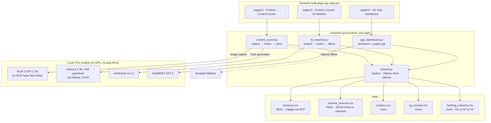

# 🛍️ shoptalkai

> TikTok Shop may be #2 in SEA, but in Singapore, it's all talk and no shop.
> **shoptalkai** closes the content-commerce gap for SG sellers, creators, and analysts.

## The insight

TikTok Shop's growth engine is the **content → discovery → purchase** flywheel. In
Indonesia and Thailand it spins because creators flood the feed with shoppable video.
Singapore's flywheel is starved at the first step: **demand exists** (healthy review
sentiment, real purchase volume) **but per-capita shoppable-content supply trails ID/TH
by an order of magnitude**. Sellers list SKUs nobody talks about; creators can't see
which products are worth their audience; nobody quantifies where the gaps are.

shoptalkai is a full-stack diagnostic tool that attacks all three failure points —
running **entirely locally on CPU**, with no paid APIs.

## Modules

| # | Module | Models | What it answers |
|---|--------|--------|-----------------|
| 1 | 🎬 Product → Content Scorer | BLIP-2 (image caption) + quantised Llama 3.2 3B via Ollama + explainable rubric | *"I'm a seller — what video do I shoot for this product?"* |
| 2 | 🤝 Product–Creator Fit Matcher | `sentence-transformers/all-MiniLM-L6-v2` | *"I'm a creator — which 5 products should I promote?"* |
| 3 | 📊 SG Gap Dashboard | DistilBERT (SST-2 sentiment) + per-capita hashtag benchmarks | *"I'm an analyst — which categories leave the most GMV on the table?"* |

Every module ends with a **business framing callout** tying its output to SG GMV.

## Architecture



## Quickstart

```bash
# 1. Python deps (CPU-only wheels are fine)
python3 -m venv .venv && source .venv/bin/activate
pip install -r requirements.txt

# 2. Local LLM (default dependency — Module 1 generates hooks with it)
brew install ollama          # or https://ollama.com/download
ollama serve &               # skip if the Ollama app is already running
ollama pull llama3.2:3b      # 4-bit quantised, ~2 GB — fits 8 GB RAM, uses Metal
                             # (override with the OLLAMA_MODEL env var; an 8 GB
                             #  machine swaps badly on the 8B model and is ~10x slower)

# 3. Run
streamlit run app.py
```

First runs download models from Hugging Face into the local cache:
MiniLM ~90 MB, DistilBERT ~270 MB, BLIP-base ~1 GB, BLIP-2 ~15 GB (optional —
Module 1's model picker defaults to BLIP-base so the demo stays fast on CPU).

**Data provenance.** The **product catalog is real** — 80 SKUs from the Kaggle
[*E-Commerce & Retail Supply Chain*](https://www.kaggle.com/datasets/rajhkumarr/e-commerce-and-retail-supply-chain)
dataset, pulled live via the **Kaggle MCP** into `data/raw/` and adapted by
`python data/adapt_kaggle.py` (real name/category/price/rating + real avg-monthly
TikTok Shop units from 160k sales, plus `channel_revenue.csv`). The mock SG layer
(creators, reviews, hashtag volumes) regenerates with
`python data/generate_mock_data.py` (seeded). Derived CSVs are committed, so the
app runs without re-downloading.

## How each module works

### 1. Product → Content Scorer
Product text (and optionally a photo, captioned by BLIP-2 on CPU) is prompted into a
locally-served quantised Llama 3.2 3B, which writes five hook candidates across distinct
persuasion angles. A **transparent rubric** — curiosity, urgency, specificity, SG
cultural relevance, spoken-hook brevity (each 0–20, +5 CTA bonus) — ranks them, so a
seller can see *why* a hook scores 85, not just that it does. Llama-written hooks are
labelled with their source; if the Ollama server is unreachable the module silently
serves deterministic SG-flavoured templates instead of failing.

### 2. Product–Creator Fit Matcher
The catalog and the creator's niche description are embedded with MiniLM;
`fit = 0.7 × cosine similarity + 0.3 × commission potential`, where commission
potential = price × commission rate × an assumed 2% of average views converting to
attributable monthly orders. Output: top-5 table plus a fit-vs-earnings scatter
("aim top-right").

### 3. SG Gap Dashboard
DistilBERT scores every SG review; `demand = review volume × positive share`.
`supply_gap = 1 − (SG per-capita videos ÷ mean(ID, TH per-capita))`.
`opportunity = normalised demand × supply gap`, ranked per category — high demand met
by thin content is exactly where incremental GMV is cheapest to unlock. Below it, a
**real channel benchmark** from 160k actual transactions (2016–2022) shows TikTok Shop
is the #2 channel behind Amazon with headroom in every category — corroborating the
under-penetration story with real sales, not just the mock content-gap signal.

## Honest limitations

- **Products are real, the SG content layer is mock.** The 80-SKU catalog and channel
  data come from a real Kaggle dataset (pulled via the Kaggle MCP). The SG-specific
  signals (hashtag volumes, creator profiles, review text) stay mock because live TikTok
  endpoints are blocked — seeded, reproducible, and scrape-ready. The Kaggle data is also
  *global multi-channel*, so it has no SG/ID/TH split; it corroborates the channel story,
  it doesn't replace the geographic thesis.
- The 2% view→order attribution rate and the 0.7/0.3 fit weights are stated assumptions,
  surfaced in the UI and tunable.
- BLIP-2 on CPU is slow (~15 GB weights); the UI offers BLIP-base as a fast demo mode.

## Project layout

```
app.py                      # entrypoint + landing page with market metrics
pages/                      # one Streamlit page per module
modules/                    # pure-Python core logic (testable without UI)
data/                       # mock datasets + seeded generator
requirements.txt
```
